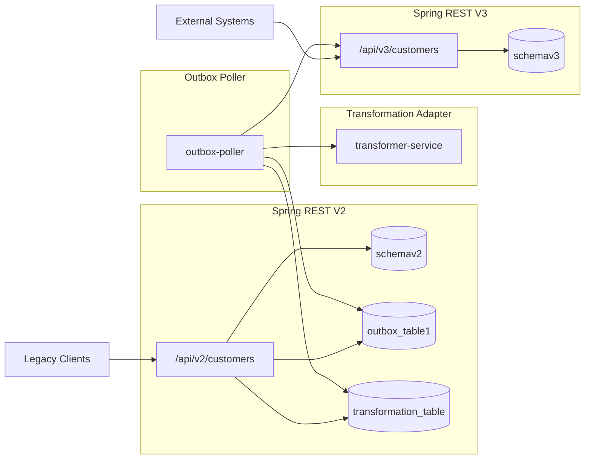
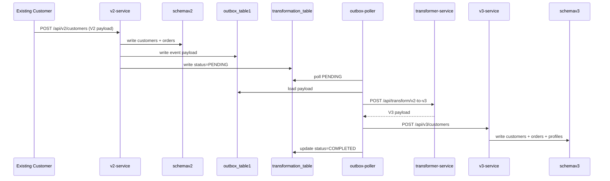

# Transformation Platform (V2 ➜ V3)

This repository contains a sample Spring Boot architecture that keeps your current V2 REST API live, persists V2 data into `schemav2`, emits an outbox event, and then transforms that payload into V3 before writing into `schemav3`.

## Services

| Service | Port | Responsibility |
| --- | --- | --- |
| `v2-service` | 8081 | V2 customer API, writes to `schemav2` tables + `outbox_table1` + `transformation_table`. |
| `transformer-service` | 8083 | External transformation service that converts V2 payloads into V3 payloads. |
| `outbox-poller` | 8084 | Polls the outbox + transformation flag, calls transformer and V3 APIs. |
| `v3-service` | 8082 | V3 customer API, writes to `schemav3` tables. |

## Architecture diagram



## Flow diagram



## Schema mapping

- **schemav2**
  - `customers`
  - `orders`
  - `outbox_table1`
  - `transformation_table`
- **schemav3**
  - `customers`
  - `orders`
  - `customer_profiles` (extra table in V3)

## Quick start

```bash
mvn -pl services/v2-service spring-boot:run
mvn -pl services/transformer-service spring-boot:run
mvn -pl services/v3-service spring-boot:run
mvn -pl services/outbox-poller spring-boot:run
```

## Example payloads

### V2 request

```json
{
  "externalId": "CUST-1001",
  "name": "Ada Lovelace",
  "email": "ada@example.com",
  "orders": [
    { "orderNumber": "ORD-1", "total": 120.50 }
  ]
}
```

### V3 request

```json
{
  "externalId": "CUST-1001",
  "fullName": "Ada Lovelace",
  "email": "ada@example.com",
  "addressLine1": "",
  "city": "",
  "orders": [
    { "orderNumber": "ORD-1", "total": 120.50 }
  ]
}
```
